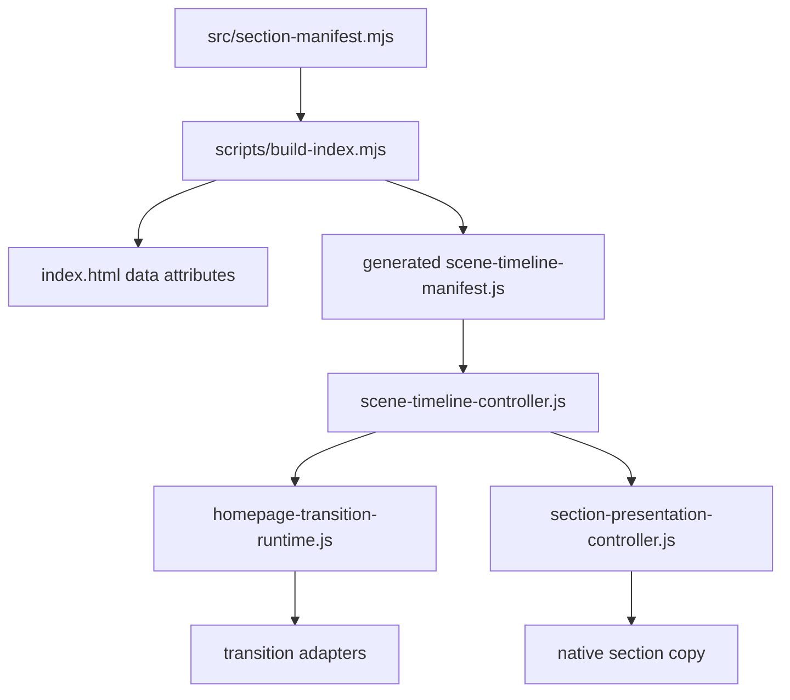

# Homepage Transition Single Timeline Plan

> Revised after architecture, race-condition, correctness, and maintainability review.
> This document supersedes the earlier plan in this file.

## Problem Statement

The homepage still behaves like two systems are trying to own the same visual moment:

- transition adapters render a full-screen scene;
- native sections separately run reveal/presentation;
- scroll snapping, post-scroll handoff, and reveal cleanup can complete in different frames;
- some adapters adopt or ghost DOM while reveal state is also being mutated.

That creates the user-visible failures we keep seeing: duplicated transition/presentation, target copy appearing too early, target copy disappearing, full-screen blank frames, and the feeling that the page jumps from one scene to another instead of handing off.

The fix should not be another local timing patch. We need one timeline owner per scene boundary.

## Non-Negotiables

1. `src/section-manifest.mjs` is the source of truth.
   `index.html` is generated. Do not hand-edit `index.html` for this work.

2. Any runtime transition manifest must be generated from `src/section-manifest.mjs`.
   Do not maintain a second manual scene manifest beside the existing section manifest.

3. Every boundary uses the same ownership model:
   `home->belief`, `belief->method`, `method-proof->brand`, `brand->services`, `services->lab`, `lab->education`, `education->philosophy`, and `philosophy->contact`.

4. Scroll-driven transitions are in scope.
   The first boundary, `home->belief`, cannot bypass the timeline just because it does not use a snap controller.

5. Post-scroll handoffs are in scope.
   `method-proof->brand` cannot have one owner for playback completion and another owner for scroll completion.

6. Adapters must not adopt real target DOM as their normal strategy.
   Source-only overlays are allowed only when explicitly declared, restored, and verified.

7. Reveal state must be committed by the timeline, using the existing cleanup semantics.
   Do not add a partial reveal helper that only sets opacity/visibility while leaving ScrollTriggers, tweens, WeakSets, or suppression state alive.

8. Deprecated receiver paths should fail loudly.
   A silent no-op `createHandoffReceiver()` would hide future regressions.

9. Verification must cover generated files after build.
   A check that passes before `npm run build:page` is not enough.

10. Do not use Playwright for this plan unless the user explicitly authorizes it.
    Browser QA for this pass is manual/local unless separately requested.

## Target Architecture

One frame should have one transaction:

1. Read scroll/snap/playback progress.
2. Resolve the active scene boundary.
3. Compute a `timelineState`.
4. Apply source and target ownership to DOM/CSS.
5. Render the adapter from the same state.
6. Commit target presentation at the declared threshold.
7. Restore/clear transition layers only after the target is committed.
8. Unlock/refresh scroll after DOM state is stable.

The adapter is no longer allowed to independently decide when native target copy is visible. It can render visual bridge material, but native section copy is owned by the scene timeline.



## Canonical Data Model

Extend `src/section-manifest.mjs`, not a separate handwritten runtime manifest.

Suggested shape:

```js
export const timelineScenes = [
  {
    id: 'belief',
    sectionId: 'belief',
    sectionSelector: '#belief',
    sectionAttributes: {
      sceneTarget: 'belief'
    },
    copySelectors: [
      {
        selector: '.section-belief__statement',
        owner: 'timeline',
        unique: true
      }
    ]
  },
  {
    id: 'method',
    sectionId: 'method',
    sectionSelector: '#method',
    sectionAttributes: {
      sceneTarget: 'method'
    },
    copySelectors: [
      {
        selector: '.method-edition-layout--after-handoff',
        owner: 'timeline',
        unique: true
      }
    ]
  }
];

export const timelineJoins = [
  {
    id: 'home-belief',
    transitionId: 'home-belief',
    progressPolicy: 'scroll',
    fromScene: 'home',
    toScene: 'belief',
    sourceOut: [0.72, 0.98],
    targetIn: [0.58, 0.92],
    commitAt: 0.86,
    presentAt: 0.92,
    cleanupAt: 0.98,
    commitCondition: ['progress:commitAt', 'lotusContracted', 'targetReady'],
    presentCondition: ['progress:presentAt', 'beliefCopyComplete'],
    adapterVariant: 'perlin-no-stretch-centered-copy'
  },
  {
    id: 'method-proof-brand',
    transitionId: 'method-tooling__method-proof',
    handoffId: 'method-proof-brand',
    progressPolicy: 'snap-playback-post-scroll',
    fromScene: 'method-proof',
    toScene: 'brand',
    sourceOut: [0.72, 0.96],
    targetIn: [0.62, 0.9],
    commitAt: 0.9,
    presentAt: 0.9,
    cleanupAt: 0.98,
    sourceOnlyGhosts: ['.method-proof']
  }
];
```

Important details:

- `method-proof-brand` must resolve by both `handoffId` and real `transitionId`.
  The actual host uses `method-tooling__method-proof`.
- `home-belief` must not use `sourceOut: [0, 0]`.
  That makes the source disappear at the first frame and can reproduce the black/blank frame.
- `commitAt` means scene ownership commit, not necessarily "copy is fully presented".
  If `targetIn` ends after `commitAt`, the reveal commit must wait for `presentAt`.
- `presentAt` defaults to `Math.max(commitAt, targetIn[1])`.
  `cleanupAt` must be greater than or equal to `presentAt`.
- `adapterVariant` is metadata, not a fake adapter option.
  If the adapter does not support a variant yet, implement the adapter API honestly.
- `data-scene-target` belongs on the section.
  `data-entry-owner="timeline"` belongs only on declared copy wrappers unless a scene explicitly sets `allowSectionOwner: true`.

## File Scope

Expected files to change:

- `/Users/aitoshuu/Documents/GitHub/TongyeGuanmi/src/section-manifest.mjs`
- `/Users/aitoshuu/Documents/GitHub/TongyeGuanmi/scripts/build-index.mjs`
- `/Users/aitoshuu/Documents/GitHub/TongyeGuanmi/src/sections/*.html`
- `/Users/aitoshuu/Documents/GitHub/TongyeGuanmi/js/transitions/homepage/scene-timeline-manifest.js`
- `/Users/aitoshuu/Documents/GitHub/TongyeGuanmi/js/transitions/homepage/scene-timeline-controller.js`
- optional `/Users/aitoshuu/Documents/GitHub/TongyeGuanmi/js/transitions/homepage/timeline-debug.js`
- `/Users/aitoshuu/Documents/GitHub/TongyeGuanmi/js/transitions/homepage-transition-runtime.js`
- `/Users/aitoshuu/Documents/GitHub/TongyeGuanmi/js/transitions/homepage/*.js`
- `/Users/aitoshuu/Documents/GitHub/TongyeGuanmi/js/transitions/homepage/section-presentation-controller.js`
- `/Users/aitoshuu/Documents/GitHub/TongyeGuanmi/js/ui/reveal.js`
- `/Users/aitoshuu/Documents/GitHub/TongyeGuanmi/css/components/homepage-continuity.css`
- `/Users/aitoshuu/Documents/GitHub/TongyeGuanmi/css/components/homepage-transitions.css`
- `/Users/aitoshuu/Documents/GitHub/TongyeGuanmi/scripts/check-homepage-transition-integration.mjs`
- `/Users/aitoshuu/Documents/GitHub/TongyeGuanmi/scripts/check-handoff-ownership.mjs`
- `/Users/aitoshuu/Documents/GitHub/TongyeGuanmi/scripts/check-section-transition-contract.mjs`
- new `/Users/aitoshuu/Documents/GitHub/TongyeGuanmi/scripts/check-homepage-timeline.mjs`
- `/Users/aitoshuu/Documents/GitHub/TongyeGuanmi/package.json`

Avoid:

- hand-editing generated `index.html`;
- adding a second handwritten scene manifest;
- adding local adapter-only reveal state;
- keeping receiver adoption as a normal target-copy path.

## Implementation Guardrails

Apply these rules when implementing:

- Do not create `js/transitions/homepage/scene-timeline-manifest.js` by hand.
  The runtime manifest must be generated by `scripts/build-index.mjs` from `src/section-manifest.mjs`.

- Do not mark timeline targets by editing `index.html` directly.
  Put durable attributes in `src/section-manifest.mjs`, `src/sections/*.html`, and `scripts/build-index.mjs`, then run `npm run build:page`.

- Do not treat `commitAt` as "all target copy is fully visible".
  Use `presentAt = Math.max(commitAt, targetIn[1])` unless the manifest explicitly declares a later `presentAt`, and keep `cleanupAt >= presentAt`.

- Do not pass a one-time `timelineState` snapshot into adapters.
  Runtime should pass a stable `timeline` adapter context, and each render frame must use the current state from that context or from runtime's render call.

- Do not put `data-entry-owner="timeline"` on whole sections by default.
  Sections may receive `data-scene-target`, but only declared copy wrappers/selectors should receive `data-entry-owner="timeline"` unless `allowSectionOwner: true` is explicitly declared.

- Do not write a contract check that only looks for exact patch strings.
  The check must validate source manifest, generated manifest, and built HTML after build.

- Do not wire the timeline only through snap `playController()`.
  That misses `home-belief`, because the first boundary is scroll-driven and does not get a snap controller.

- Do not assume `presentationController` already exists inside `initHomepageTransitions()`.
  In the current runtime it is created inside `createHomepageSnapCoordinator()`, so this plan requires a small ownership refactor before adapters mount.

- Do not make `method-proof-brand` resolve only by `data-transition-id="method-proof-brand"`.
  The real transition host is `data-transition-id="method-tooling__method-proof"`, with `handoffId: 'method-proof-brand'`.

- Do not keep `copyOut: [0, 0]` or equivalent for `home-belief`.
  It can hide the source on the first frame and recreates the black/blank handoff.

- Do not leave `createHandoffReceiver()` as a silent no-op.
  Once adapters are migrated, the receiver path should throw in development or be deleted so future misuse is visible.

- Do not add fake adapter knobs such as `beliefImageFit = 'contain'` unless the adapter or shader really supports them.
  For the desired perlin / non-stretched / centered Belief scene, either use existing `imageRect` / `imageScale` behavior correctly or add a real adapter API.

- Do not solve Figure3 by adding one-off handoff metadata in generated `index.html`.
  `brand->services`, `services->lab`, and `lab->education` should use the same timeline target commit model as the handoff transitions.

- Do not add a partial `presentRevealWithin()` helper that bypasses existing reveal cleanup.
  It must reuse the existing mark-presented path so ScrollTriggers, tweens, suppress-once state, and final inline styles cannot fight the timeline.

- Do not let `home-belief` commit from progress alone.
  Pattern Bloom must expose semantic milestones such as `lotusContracted`, `targetReady`, and `beliefCopyComplete`, and timeline commit/present decisions must include those milestones.

## Implementation Plan

### 0. Preflight

Confirm the branch and build state before edits:

```bash
git status --short
git branch --show-current
npm run build:page
npm run verify:homepage-transitions
npm run verify:handoff-ownership
```

Record any existing dirty files before editing. Do not revert unrelated user changes.

### 1. Add Timeline Metadata To The Source Manifest

Edit `/Users/aitoshuu/Documents/GitHub/TongyeGuanmi/src/section-manifest.mjs`.

Add timeline metadata for every scene that can be a native target:

- `belief`
- `method`
- `brand`
- `services`
- `lab`
- `education`
- `philosophy`
- `contact`

Add timeline joins for:

- `home-belief`
- `belief-method`
- `method-proof-brand`
- `brand-services`
- `services-lab`
- `lab-education`
- `education-philosophy`
- `philosophy-contact`

For each join declare:

- `id`
- `transitionId`
- `handoffId` when different from transition id
- `progressPolicy`
- `fromScene`
- `toScene`
- `sourceOut`
- `targetIn`
- `commitAt`
- allowed `sourceOnlyGhosts`, if any

Do not duplicate strings in adapters that can come from this manifest.

### 2. Generate Runtime Timeline Data

Update `/Users/aitoshuu/Documents/GitHub/TongyeGuanmi/scripts/build-index.mjs` so it:

1. injects generated ownership attributes into built `index.html`;
2. writes `/Users/aitoshuu/Documents/GitHub/TongyeGuanmi/js/transitions/homepage/scene-timeline-manifest.js`;
3. includes a generated-file header:

```js
// Generated by scripts/build-index.mjs from src/section-manifest.mjs. Do not edit.
```

The generated runtime manifest should contain only serializable browser data:

- `timelineScenes`
- `timelineJoins`
- useful lookup maps if needed

The build should be idempotent. Running `npm run build:page` twice should produce no diff.

### 3. Add A Timeline Contract Check Early

Create `/Users/aitoshuu/Documents/GitHub/TongyeGuanmi/scripts/check-homepage-timeline.mjs`.

It should check the source and generated output after build:

- every timeline join references existing scenes;
- every timeline join references an actual transition host by `transitionId`, `handoffId`, or selector;
- `home-belief` has `progressPolicy: 'scroll'`;
- `method-proof-brand` resolves `transitionId: 'method-tooling__method-proof'`;
- no timeline join uses `[0, 0]` as `sourceOut` or `targetIn`;
- every timeline scene section has generated `data-scene-target`;
- every declared copy selector resolves to at least one element in built `index.html`;
- every declared copy selector resolves inside its declared section;
- critical copy selectors resolve uniquely unless `allowMany: true` is declared;
- `data-entry-owner="timeline"` is not generated on a whole section unless `allowSectionOwner: true` is declared;
- every join satisfies `presentAt >= commitAt` and `cleanupAt >= presentAt`;
- every generated runtime manifest has the generated-file header;
- old receiver adoption is not required by any adapter contract.

Add package script:

```json
"verify:homepage-timeline": "node scripts/check-homepage-timeline.mjs"
```

Do not add it to `verify:all` until it passes.

### 4. Implement The Scene Timeline Controller

Create `/Users/aitoshuu/Documents/GitHub/TongyeGuanmi/js/transitions/homepage/scene-timeline-controller.js`.

The controller should own:

- active join resolution;
- normalized progress;
- source opacity;
- target opacity;
- target presentation commit;
- adapter state snapshots;
- cleanup after completion.

Public API sketch:

```js
export function createSceneTimelineController({
  joins,
  scenes,
  presentationController,
  root = document
}) {
  return {
    attachHost(host, options),
    begin(joinId, options),
    update(joinId, progress, options),
    commit(joinId, reason),
    complete(joinId, reason),
    getState(joinId),
    createAdapterContext(host, options)
  };
}
```

Adapters must not receive a one-time timeline snapshot.
Use one stable adapter context shape:

```js
module.mount(host, {
  ...existingOptions,
  timeline: adapterContext
});
```

The context should expose the current state and update hooks in one place:

```js
{
  join,
  getState(),
  update(progress, reason),
  commit(reason),
  present(reason),
  complete(reason)
}
```

Adapters may read `timeline.getState()` during render, or runtime may pass the latest state into an adapter render callback.
Do not make each adapter guess whether `timelineState` is an object, function, mutable ref, or mount-time snapshot.

Minimum state:

```js
{
  joinId,
  transitionId,
  progress,
  sourceOpacity,
  targetOpacity,
  targetCommitted,
  active,
  completing,
  reducedMotion
}
```

The controller should apply CSS custom properties on the host or root:

- `--timeline-source-opacity`
- `--timeline-target-opacity`
- `--timeline-progress`

The controller should commit target presentation through `section-presentation-controller`, not by ad hoc inline styles.

### 5. Wire Runtime Before Adapters Mount

Update `/Users/aitoshuu/Documents/GitHub/TongyeGuanmi/js/transitions/homepage-transition-runtime.js`.

Important runtime constraint:

- `presentationController` is currently created inside `createHomepageSnapCoordinator()`.
- `initHomepageTransitions()` mounts all hosts.
- The scene timeline must be available to both.

Refactor so the timeline and presentation controller are available before adapter mount.

Required wiring:

1. Create or expose `presentationController` at a level where the timeline can use it.
2. Create `sceneTimeline` in `initHomepageTransitions()`.
3. Pass `sceneTimeline` into `createHomepageSnapCoordinator({ sceneTimeline, presentationController })`.
4. For each transition host, call `sceneTimeline.attachHost(host, { progressPolicy })`.
5. Pass the adapter context into every `mount()`:

```js
module.mount(host, {
  ...existingOptions,
  timeline: adapterContext
});
```

Do not only wire `playController`; that misses scroll-driven transitions.

### 6. Cover Every Progress Policy

The timeline must receive progress from all transition types.

For `home-belief`:

- its scroll `progressSource()` must update the timeline;
- target commit happens when timeline progress reaches `commitAt`;
- the adapter renders from timeline state;
- no local `sourceOut: [0, 0]` fade.

For snap playback transitions:

- snap coordinator updates timeline before adapter render for the same frame;
- target commit happens before host release/scroll unlock.

For post-scroll handoffs:

- playback completion does not finish native target presentation by itself;
- post-scroll completion updates the same join;
- target commit happens once, after post-scroll progress reaches threshold;
- scroll unlock and `ScrollTrigger.refresh()` happen after commit.

For reduced motion/direct hash:

- timeline commits the target synchronously;
- adapters do not run partial reveal states;
- no receiver or ghost layer remains active.

### 7. Preserve Reveal Cleanup Semantics

Update `/Users/aitoshuu/Documents/GitHub/TongyeGuanmi/js/transitions/homepage/section-presentation-controller.js`.

The timeline needs a public helper that preserves existing cleanup:

```js
export function presentRevealWithin(root, options = {}) {
  // calls the existing markPresented path for root and descendants
}
```

This helper must:

- kill existing reveal tween/ScrollTrigger state;
- add final visible classes/attributes;
- set final transform/opacity/visibility;
- clear or honor suppress-once state;
- not create a second reveal lifecycle.

Also update the global reveal initialization:

- do not blindly run `gsap.set('.reveal', hidden)` against timeline-owned sections;
- initialize each reveal node individually;
- skip nodes already owned/committed by the timeline.

### 8. Remove Target DOM Adoption

After native target commit works, remove target adoption from:

- AOD / `belief->method`
- Figure2 / `method-proof->brand`
- Crane / `philosophy->contact`

`createHandoffReceiver()` should become a hard failure in development or be deleted after all imports are removed.

Do not leave a silent compatibility shim.

Keep `createProofScrollOverlay()` only if it is source-only:

- declared in `sourceOnlyGhosts`;
- never treated as target copy;
- restored before brand commit;
- covered by verification.

### 9. Adapter Updates

#### Pattern Bloom / Home To Belief

The first boundary is the most important one to fix.

Required behavior:

- lotus transition can remain full-screen;
- the native Belief statement must be timeline-owned;
- transition must not finish to black/blank before Belief is committed;
- second-scene upper/lower copy must not be split into two independent reveal passes.
- `home-belief` cannot commit only because `progress >= commitAt`.
  It must also satisfy `lotusContracted` and `targetReady`.
- `home-belief` cannot present copy only because `progress >= presentAt`.
  It must also satisfy `beliefCopyComplete`, or the adapter must explicitly report that the Belief copy has reached its final visual state.

Do not add fake adapter options such as `beliefImageFit = 'contain'` unless the adapter really supports them.

Current ink scene code uses shader UV mapping (`coverUv`) and supports image placement via its actual API. If the desired "perlin, non-stretched, centered" look needs new behavior, add a real adapter API or shader option and test it structurally.

#### AOD / Belief To Method

Required behavior:

- transition visual leads into the Method hero;
- Method text is committed once;
- no blank page between AOD completion and Method copy;
- old receiver restore cannot re-hide Method copy.

#### Figure2 / Method Proof To Brand

Required behavior:

- second Figure2 phase and text complete into Brand copy;
- no full white/blank frame after phase two;
- `method-proof-brand` resolves using the actual transition host id `method-tooling__method-proof`;
- source proof overlay is source-only and restored before Brand commit.

#### Figure3 / TTG / PH

Required behavior:

- visual bridges only bridge;
- Services, Lab, and Education copy are committed by the timeline before the host releases;
- no active boundary where the target section is in view but copy is hidden;
- no duplicated target copy inside adapter DOM.

#### Crane / Philosophy To Contact

Required behavior:

- crane animation commits Contact once;
- no one-frame flash of Contact followed by Contact replay;
- no receiver residue.

### 10. CSS State Model

Update CSS after timeline controller exists.

Rules:

- timeline-owned copy starts controlled by `data-entry-owner="timeline"`;
- whole sections receive `data-scene-target`, not `data-entry-owner="timeline"`, unless explicitly allowed;
- active boundary state uses timeline CSS variables;
- committed state is stable without transition host classes;
- no CSS path should hide committed copy because a host class remains for one extra frame;
- receiver/gate CSS should be removed once unused.

Representative selectors:

```css
[data-entry-owner='timeline'] {
  opacity: var(--timeline-target-opacity, 0);
}

[data-entry-owner='timeline'][data-entry-state='presented'] {
  opacity: 1;
  visibility: visible;
  transform: none;
}
```

Keep this scoped. Do not create broad selectors that affect non-homepage pages.

### 11. Update Existing Verification Scripts

Update old checks in the same change set that removes old ownership.

Current scripts may still assert the previous receiver contract:

- `/Users/aitoshuu/Documents/GitHub/TongyeGuanmi/scripts/check-homepage-transition-integration.mjs`
- `/Users/aitoshuu/Documents/GitHub/TongyeGuanmi/scripts/check-handoff-ownership.mjs`

They should now assert:

- no adapter imports `createHandoffReceiver`;
- no adapter clones/adopts target section copy;
- source-only ghosts are declared in `timelineJoins`;
- every timeline-owned target has a commit path;
- generated manifest and built HTML agree.

Avoid tests that only regex for one line of code. The checks should validate the contract, not the patch shape.

### 12. Manual QA Without Playwright

Unless separately authorized, use local browser/manual QA.

Run:

```bash
npm run build:page
npm run dev
```

Check these flows in a normal window and in a large window:

- `home->belief`: no black/blank handoff; Belief statement appears in the same visual moment.
- Belief upper/lower scene: no second independent reveal; right-side/statement copy is not eaten.
- `belief->method`: AOD completes directly into Method copy.
- `method-proof->brand`: Figure2 phase two completes directly into Brand copy.
- `brand->services`: no target copy loss.
- `services->lab`: no target copy loss.
- `lab->education`: no target copy loss.
- `philosophy->contact`: no Contact flash then replay.

Useful debug overlay while developing:

- current join id;
- progress;
- source opacity;
- target opacity;
- target committed;
- active host id;
- pending ghost count.

Remove or guard debug overlay before final shipping.

### 13. Final Verification

Final commands:

```bash
npm run build:page
npm run verify:homepage-timeline
npm run verify:homepage-transitions
npm run verify:handoff-ownership
npm run verify:all
npm run verify:homepage-timeline
```

Run the last timeline check again because `verify:all` starts with `build:page` and can regenerate files.

Also inspect removed patterns:

```bash
rg "createHandoffReceiver|data-handoff-receiver|handoffReceiver" js scripts src
rg "sourceOut: \[0,\s*0\]|targetIn: \[0,\s*0\]" src js
rg "data-entry-owner=\"timeline\"" index.html
```

Expected outcome:

- no target receiver adoption path remains;
- generated runtime manifest is in sync with source manifest;
- every active boundary has one timeline owner;
- no transition releases before native target copy is committed.

## Commit Strategy

Prefer small vertical commits:

1. source manifest + generated timeline manifest + contract check;
2. timeline controller + runtime wiring;
3. reveal commit helper + CSS state model;
4. adapter migrations;
5. receiver removal + verification updates;
6. final build output.

Do not merge a commit that leaves generated `index.html` stale after changing source sections or manifests.

## Risk Register

| Risk | Why It Matters | Mitigation |
| --- | --- | --- |
| Generated files drift | `index.html` can overwrite manual fixes | edit source files and run `build:page` before checks |
| Scroll-driven boundary bypasses timeline | keeps `home->belief` broken | attach timeline to scroll progress source |
| Post-scroll has a second owner | recreates Figure2/AOD blanks | make post-scroll update the same join |
| Reveal helper is partial | text can disappear after commit | reuse existing `markPresented` cleanup |
| Silent receiver no-op | future adapter can regress unnoticed | throw/delete after imports removed |
| Fake adapter options | plan passes on paper but not in code | only document options that exist or add them explicitly |
| Verification asserts old contract | tests force wrong architecture | update checks with the migration |

## Definition Of Done

This work is done only when:

- all transition boundaries are represented in the canonical timeline data;
- runtime timeline manifest is generated from `src/section-manifest.mjs`;
- every adapter receives timeline state from runtime;
- target copy is committed exactly once per boundary;
- target DOM adoption has been removed or hard-failed;
- generated `index.html` is current;
- verification commands pass;
- manual browser QA confirms no duplicated presentation, no eaten text, no blank bridge, and no post-transition replay on the listed flows.
